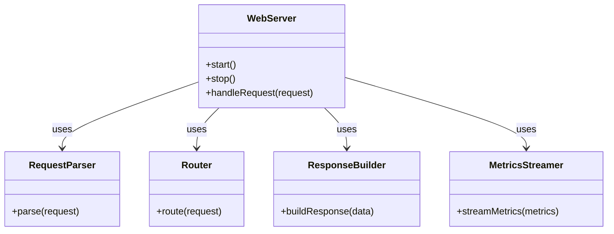

# BuildYourOwnWebserver (Glass Box)
Glass Box is an educational HTTP/1.1 server built to demystify web protocols. It exposes the "hidden" work of a web server by streaming internal metrics to a client-side dashboard, allowing users to watch their requests flow through the parsing, routing, and response pipeline live.

## Milestones
The Milestones can be found under the [Milestones Tab](https://github.com/90S31D0N/BuildYourOwnWebserver/milestones)
## Features
The Features are listed under the [Issues Tab](https://github.com/90S31D0N/BuildYourOwnWebserver/issues)

