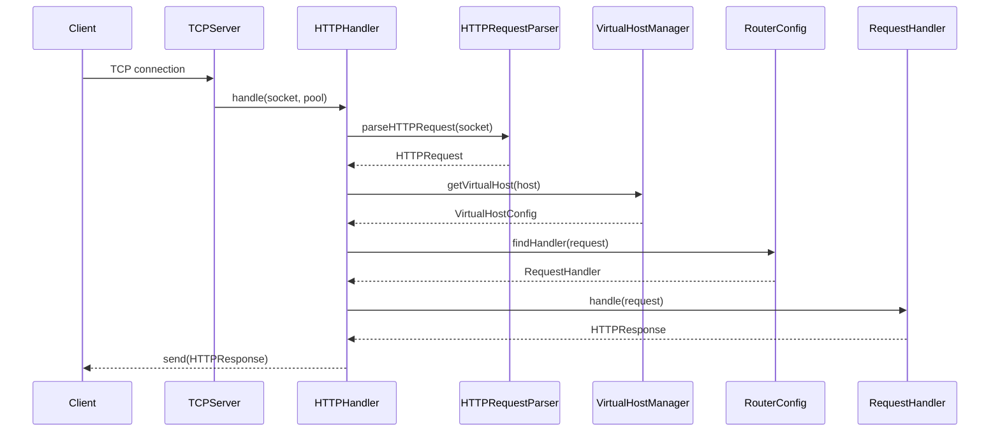
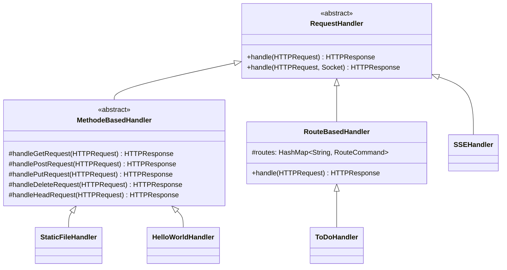
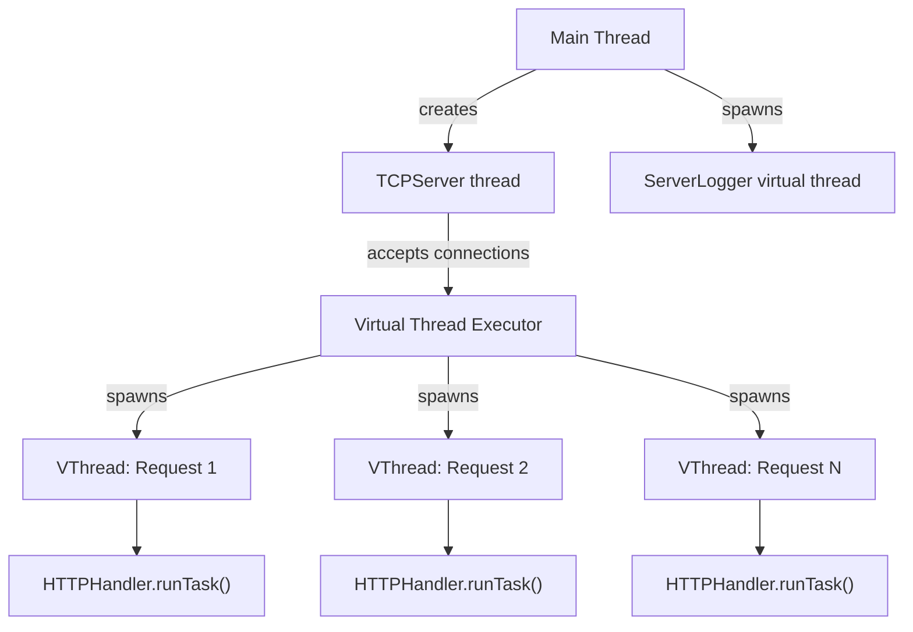

# Architecture Overview

Glass Box follows a modular, layered architecture designed for transparency and educational value. The codebase is split into two packages: `com.ns.tcpframework` (the reusable HTTP server framework) and `com.ns.webserver` (the application layer with handlers and models).

## Request Lifecycle

Every HTTP request passes through these stages:



1. **TCPServer** accepts a raw TCP connection and submits the socket to a virtual thread pool.
2. **HTTPHandler** receives the socket and delegates parsing to `HTTPRequestParser`.
3. **HTTPRequestParser** reads the raw byte stream, detects the `\r\n\r\n` header boundary, and constructs an `HTTPRequest` with the method, path, headers, and body stream.
4. **VirtualHostManager** resolves the `Host` header to the correct `VirtualHostConfig`.
5. **RouterConfig** matches the request path against registered patterns (exact match first, then wildcard patterns like `/api/todos/*`). If no match is found, the `StaticFileHandler` is used as the default.
6. **RequestHandler** processes the request and returns an `HTTPResponse`.
7. The response is serialized and sent back through the socket.

If any stage throws an exception, `HTTPErrorHandler` catches it and maps it to the appropriate HTTP error response (400, 404, 500, or 501).

## Core Components

### TCPServer

The entry point of the server. Extends `Thread` and runs an accept loop on a `ServerSocket`. Each incoming connection is submitted to an `ExecutorService` backed by virtual threads.

```java
while (true) {
    var clientSocket = serverSocket.accept();
    handler.handle(clientSocket, pool);
}
```

### HTTPHandler

Coordinates the full request-response cycle. Receives a socket from `TCPServer`, delegates parsing, resolves the virtual host, finds the matching handler, and sends the response. Also increments the `Stats` request counter and logs the request via `ServerLogger`.

### HTTPRequestParser

A stateless utility class that reads HTTP/1.1 from raw input streams. The parser uses a state machine to detect the `\r\n\r\n` header terminator, then extracts:
- **Request line** — method, path, HTTP version
- **Headers** — parsed into a `LinkedHashMap<String, String[]>` (case-insensitive keys, multi-value support)
- **Body** — wrapped in a `FixedLengthInputStream` constrained by the `Content-Length` header

### HTTPRequest and HTTPResponse

Simple data classes. `HTTPRequest` is immutable after construction. `HTTPResponse` provides a builder-style API:

```java
HTTPResponse response = new HTTPResponse(200, "OK");
response.setHeader("X-Custom", "value");
response.setBody(jsonBytes, "application/json");
response.send(socket);
```

## Handler Hierarchy

Glass Box provides three base classes for implementing request handlers, each offering a different level of abstraction:



| Base Class | Use Case | Pattern |
|---|---|---|
| `RequestHandler` | Full control over request and socket | Direct override |
| `MethodeBasedHandler` | Handle requests by HTTP method | Template Method |
| `RouteBasedHandler` | Handle requests by path pattern | Command / Strategy |

See [Custom Handlers](../configuration/Custom%20Handlers.md) for implementation details.

## Configuration and Handler Discovery

Configuration is loaded from YAML files by `ConfigLoader`, which uses Jackson for deserialization. The `HandlerFactory` uses the [Reflections](https://github.com/ronmamo/reflections) library to scan the classpath for all `RequestHandler` subclasses at startup. This means handlers are resolved by simple class name in the YAML config:

```yaml
routes:
  /api/todos/*: ToDoHandler   # Resolves to com.ns.webserver.handlers.ToDoHandler
  /api/sse: SSEHandler         # Resolves to com.ns.tcpframework.reqeustHandlers.sse.SSEHandler
```

No manual registration or factory wiring is needed — just add a handler class anywhere under the `com.ns` package and reference it by name.

## Threading Model

Glass Box uses Java 25 **virtual threads** (`Executors.newVirtualThreadPerTaskExecutor()`). Each incoming connection gets its own lightweight virtual thread, enabling thousands of concurrent connections without the overhead of platform threads.



Key threading details:
- **TCPServer** runs on its own platform thread (extends `Thread`)
- **ServerLogger** runs on a dedicated virtual thread, processing log entries from a `BlockingQueue`
- **Stats** runs on a platform thread for system metrics collection (CPU, memory via OSHI)
- **SSE connections** keep their virtual thread alive in a sleep loop, broadcasting heartbeats every second

## Error Handling

Exceptions are mapped to HTTP status codes by `HTTPErrorHandler`:

| Exception | Status Code | Response |
|---|---|---|
| `BadRequestException` | 400 | Bad Request |
| `NotFoundException` | 404 | Not Found |
| `InternalServerErrorException` | 500 | Internal Server Error |
| `NotImplementedException` | 501 | Not Implemented |
| Any other `Exception` | 500 | Internal Server Error |

All errors are also logged via `ServerLogger` and broadcast to SSE clients.

## Full Class Diagram

```mermaid
classDiagram
      direction TB

      %% === ENTRY POINT ===
      class Main {
          +main(String[] args)$
      }

      %% === TCP/HTTP CORE ===
      class TCPServer {
          -HTTPHandler handler
          -ServerSocket serverSocket
          -ExecutorService pool
          +run()
          +stopServer()
      }
      Thread <|-- TCPServer

      class HTTPHandler {
          -VirtualHostManager vManager
          +handle(Socket socket, ExecutorService pool)
          -runTask(Socket socket)
      }

      class HTTPRequest {
          -HTTPMethode method
          -String path
          -String httpVersion
          -Map~String, String[]~ headers
          -byte[] bodyBytes
          -String host
          +getMethod() HTTPMethode
          +getPath() String
          +getBody() String
          +getHost() String
      }

      class HTTPResponse {
          -int statusCode
          -String statusMessage
          -HashMap~String, String[]~ headers
          -byte[] body
          -boolean sended
          +setHeader(String key, String value)
          +setBody(byte[] body, String contentType)
          +send(Socket socket)
          +isSended() boolean
      }

      class HTTPMethode {
          <<enumeration>>
          GET
          POST
          PUT
          DELETE
          HEAD
          OPTIONS
      }

      class HTTPRequestParser {
          +parseHTTPRequest(Socket socket)$ HTTPRequest
          +getHTTPHeader(InputStream in)$ String
          -extractMethode(String[] line)$ HTTPMethode
          -extractPath(String[] line)$ String
          -extractHttpVersion(String[] line)$ String
          -extractHttpHeaders(BufferedReader in)$ LinkedHashMap
          +bodyStream(InputStream in, int contentLength)$ InputStream
      }

      class HTTPErrorHandler {
          +sendError(Socket, int, String)$
          +sendBadRequest(Socket)$
          +sendNotFound(Socket)$
          +sendInternalError(Socket)$
          +sendMethodNotAllowed(Socket)$
          +sendNotImplemented(Socket)$
          +handleException(Socket, Exception)$
      }

      class FixedLengthInputStream {
          -InputStream in
          -long remaining
          +read() int
      }
      InputStream <|-- FixedLengthInputStream

      %% === REQUEST HANDLER HIERARCHY ===
      class RequestHandler {
          <<abstract>>
          +handle(HTTPRequest request)* HTTPResponse
          +handle(HTTPRequest request, Socket socket) HTTPResponse
      }

      class MethodeBasedHandler {
          <<abstract>>
          +handle(HTTPRequest request) HTTPResponse
          #handleGetRequest(HTTPRequest) HTTPResponse
          #handlePostRequest(HTTPRequest) HTTPResponse
          #handlePutRequest(HTTPRequest) HTTPResponse
          #handleDeleteRequest(HTTPRequest) HTTPResponse
          #handleHeadRequest(HTTPRequest) HTTPResponse
      }
      RequestHandler <|-- MethodeBasedHandler

      class RouteBasedHandler {
          #HashMap~String, RouteCommand~ routes
          +handle(HTTPRequest request) HTTPResponse
      }
      RequestHandler <|-- RouteBasedHandler

      class StaticFileHandler {
          -String rootPath
          +handleGetRequest(HTTPRequest) HTTPResponse
          +handleHeadRequest(HTTPRequest) HTTPResponse
      }
      MethodeBasedHandler <|-- StaticFileHandler

      class HelloWorldHandler {
          +handleGetRequest(HTTPRequest) HTTPResponse
      }
      MethodeBasedHandler <|-- HelloWorldHandler

      class ToDoHandler {
          -HashMap~UUID, ToDo~ toDoStore
          +handleOptions(HTTPRequest) HTTPResponse
          -sendAllToDos(HTTPRequest) HTTPResponse
          -addTodo(HTTPRequest) HTTPResponse
          -updateTodo(HTTPRequest) HTTPResponse
          -deleteTodo(HTTPRequest) HTTPResponse
      }
      RouteBasedHandler <|-- ToDoHandler

      class SSEHandler {
          -Set~Socket~ sockets
          +handle(HTTPRequest, Socket) HTTPResponse
          +broadcast(SSEEvent event, String message)
          +send(Socket socket, String message)
          +removeSocket(Socket socket)
          +hasClients() boolean
          +clientCount() int
      }
      RequestHandler <|-- SSEHandler

      class RouteCommand {
          <<interface>>
          +run(HTTPRequest request) HTTPResponse
      }

      %% === MODELS ===
      class ToDo {
          <<record>>
          +UUID id
          +String title
          +boolean completed
      }

      %% === CONFIGURATION ===
      class ServerConfig {
          -String environment
          -int port
          -Loglevel loglevel
          -VirtualHostConfig defaultHost
          -Map~String, VirtualHostConfig~ hosts
          +getPort() int
          +getLoglevel() Loglevel
          +getDefaultHost() VirtualHostConfig
          +getHosts() Map
      }

      class VirtualHostConfig {
          -String host
          -String documentRoot
          -RouterConfig router
          +getHost() String
          +getDocumentRoot() String
          +getRouter() RouterConfig
          +getSSEHandler() SSEHandler
      }

      class VirtualHostManager {
          -HashMap~String, VirtualHostConfig~ virtualHosts
          -VirtualHostConfig defaultVirtualHost
          +registerVirtualHost(VirtualHostConfig vhost)
          +getVirtualHost(String host) VirtualHostConfig
          +getSSEHandler() SSEHandler
      }

      class RouterConfig {
          -Map~String, RequestHandler~ routes
          -MethodeBasedHandler defaultHandler
          +register(String pathPattern, RequestHandler handler)
          +findHandler(HTTPRequest request) RequestHandler
          -matchPattern(String path, String pattern) boolean
          +getSSEHandler() SSEHandler
      }

      class ConfigLoader {
          +load(String environment)$ ServerConfig
          -buildHosts(Map hosts)$ Map
      }

      class HandlerFactory {
          -Map~String, Class~ handlerCache$
          +getRequestHandlerByName(String className)$ RequestHandler
      }

      %% === LOGGING ===
      class ServerLogger {
          -ServerLogger instance$
          -SSEHandler sseHandler
          -Loglevel loglevel
          -BlockingQueue~Log~ logQueue
          -boolean running
          +initialize(SSEHandler, Loglevel)$
          +getInstance()$ ServerLogger
          +log(Loglevel, String, LogDestination)
          -processLog(Log)
          +run()
          +shutdown()
      }
      Runnable <|.. ServerLogger

      class Stats {
          -Stats instance$
          -AtomicLong startTime
          -AtomicLong totalRequests
          -AtomicLong activeConnections
          -boolean running
          +init()$
          +getInstance()$ Stats
          +getStatsAsJson() JSONObject
          +incrementRequests()
          +getCPUUsage() double
          +getMemUsage() double
          +run()
      }
      Runnable <|.. Stats

      class Log {
          -Loglevel level
          -String message
          -long timestamp
          -LogDestination destination
          +toJson() JSONObject
      }

      class Loglevel {
          <<enumeration>>
          DEBUG
          INFO
          WARN
          ERROR
          FATAL
          +getLevel() int
          +isHigherOrEqual(Loglevel) boolean
      }

      class LogDestination {
          <<enumeration>>
          SERVER
          CLIENT
          EVERYWHERE
      }

      class SSEEvent {
          <<enumeration>>
          LOG
          STATS
          CONNECTED
          HEARTBEAT
      }

      %% === EXCEPTIONS ===
      class BadRequestException
      class NotFoundException
      class InternalServerErrorException
      class NotImplementedException
      Exception <|-- BadRequestException
      Exception <|-- NotFoundException
      Exception <|-- InternalServerErrorException
      Exception <|-- NotImplementedException

      %% === RELATIONSHIPS ===
      Main --> TCPServer : creates
      Main --> ConfigLoader : uses
      Main --> ServerLogger : initializes
      Main --> VirtualHostManager : creates

      TCPServer --> HTTPHandler : uses
      HTTPHandler --> VirtualHostManager : uses
      HTTPHandler --> HTTPRequestParser : uses
      HTTPHandler --> HTTPErrorHandler : uses
      HTTPHandler --> HTTPRequest : processes
      HTTPHandler --> HTTPResponse : creates

      HTTPRequest --> HTTPMethode : contains
      HTTPRequestParser --> FixedLengthInputStream : creates

      VirtualHostManager --> VirtualHostConfig : manages
      VirtualHostConfig --> RouterConfig : contains
      RouterConfig --> RequestHandler : routes to
      RouterConfig --> StaticFileHandler : default

      RouteBasedHandler --> RouteCommand : uses
      ToDoHandler --> ToDo : stores

      SSEHandler --> SSEEvent : uses
      SSEHandler --> Stats : broadcasts

      ServerLogger --> SSEHandler : pushes logs
      ServerLogger --> Log : queues
      ServerLogger --> Loglevel : filters by
      Log --> Loglevel : has
      Log --> LogDestination : has

      ConfigLoader --> ServerConfig : creates
      ConfigLoader --> HandlerFactory : uses
      ServerConfig --> VirtualHostConfig : contains
      ServerConfig --> Loglevel : contains
```

<details>
<summary>Click to expand the complete class diagram</summary>



</details>
