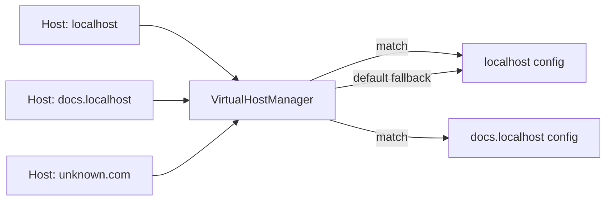

# Virtual Hosts

Glass Box supports **name-based virtual hosting**, allowing a single server instance to serve multiple domains, each with its own document root and route configuration.

## How It Works

When a request arrives, the server reads the `Host` HTTP header and looks up the matching `VirtualHostConfig` in the `VirtualHostManager`. If no match is found, the request is routed to the default host.



### Host Resolution

The `Host` header is normalized before lookup:
- Port numbers are stripped (`localhost:8080` becomes `localhost`)
- Comparison is case-insensitive

## Configuration

Virtual hosts are defined in the YAML config under the `hosts` key:

```yaml
defaultHost: localhost

hosts:
  localhost:
    documentRoot: "frontend/out"
    routes:
      /hello: HelloWorldHandler
      /api/todos/*: ToDoHandler
      /api/sse: SSEHandler

  docs.localhost:
    documentRoot: "docs/build"
    routes:
      /hello: HelloWorldHandler
```

### Per-Host Properties

| Property | Description |
|---|---|
| `documentRoot` | Base directory for static file serving. The `StaticFileHandler` resolves file paths relative to this directory. |
| `routes` | Map of URL patterns to handler class names. Supports exact paths and wildcard patterns (see below). |

### Default Host

The `defaultHost` value must match one of the keys in the `hosts` map. Requests with an unrecognized or missing `Host` header are routed to this host.

## Route Matching

Each virtual host has its own `RouterConfig` that matches request paths in this order:

1. **Exact match** — the path exactly equals a registered pattern (e.g., `/hello`)
2. **Wildcard match** — the path matches a `/*` suffix pattern (e.g., `/api/todos/*` matches `/api/todos`, `/api/todos/123`, etc.)
3. **Default handler** — if no route matches, the `StaticFileHandler` serves files from the `documentRoot`

### Wildcard Patterns

Wildcard routes use the `/*` suffix:

```yaml
routes:
  /api/todos/*: ToDoHandler
```

This matches:
- `/api/todos` (the base path itself)
- `/api/todos/` (with trailing slash)
- `/api/todos/abc-123` (with sub-path)
- `/api/todos/abc-123/nested` (any depth)

## Local Development

To test virtual hosts locally, you need to configure DNS or your hosts file. For development with `*.localhost` subdomains:

:::info
Most modern browsers resolve `*.localhost` to `127.0.0.1` automatically. If yours doesn't, add entries to `/etc/hosts`:

```bash
127.0.0.1   a.localhost
127.0.0.1   docs.localhost
::1         a.localhost
::1         docs.localhost
```
:::

## Architecture

Internally, virtual hosts are composed of these classes:

- **`VirtualHostManager`** — Registry that maps hostnames to configs. Created once at startup.
- **`VirtualHostConfig`** — Holds the hostname, document root, and `RouterConfig` for a single host.
- **`RouterConfig`** — Maps URL patterns to `RequestHandler` instances. Each config creates a `StaticFileHandler` as its default handler, initialized with the host's document root.
